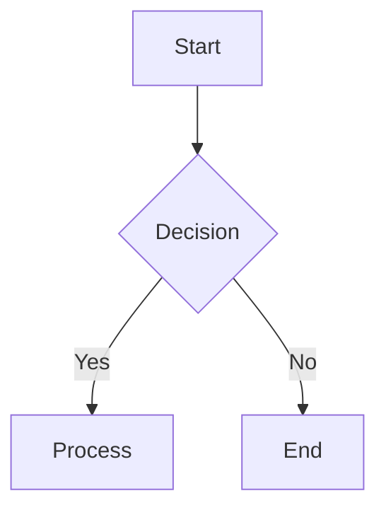

# Mermaid → TikZ Conversion

TikZ is preferred for final output:

- vector PDF
- consistent typography/colors with moderndoc
- stable in PDF/A workflows

## Recommended workflow

1. **Prototype** in Mermaid (fast)
2. **Render** Mermaid to PDF/PNG (for review)
3. **Convert** to TikZ for final submission

## Mermaid CLI (prototype render)

```bash
npm install -g @mermaid-js/mermaid-cli
```

Render:

```bash
mmdc -i diagram.mmd -o figures/diagram.pdf --pdfFit
```

Include while prototyping:

```tex
\begin{figure}[htbp]
\centering
\includegraphics[width=0.8\textwidth]{figures/diagram.pdf}
\caption{Prototype diagram}
\end{figure}
```

## Shape mapping

| Mermaid    | TikZ idea         |
| ---------- | ----------------- |
| `[Text]`   | rectangle         |
| `(Text)`   | rounded rectangle |
| `{Text}`   | diamond           |
| `((Text))` | circle            |

## Arrow mapping

| Mermaid | TikZ         |
| ------- | ------------ |
| `-->`   | `->`         |
| `-.->`  | `->, dashed` |
| `<-->`  | `<->`        |

## Example conversion (Mermaid → TikZ)

Mermaid:



TikZ (with moderndoc styles from `diagrams-tikz.md`):

```tex
\begin{tikzpicture}[node distance=1.4cm]
\node[mdoc rounded] (A) {Start};
\node[mdoc decision, below=of A] (B) {Decision};
\node[mdoc box, below left=of B] (C) {Process};
\node[mdoc box, below right=of B] (D) {End};

\draw[mdoc arrow] (A) -- (B);
\draw[mdoc arrow] (B) -- node[left,font=\small] {Yes} (C);
\draw[mdoc arrow] (B) -- node[right,font=\small] {No} (D);
\end{tikzpicture}
```
